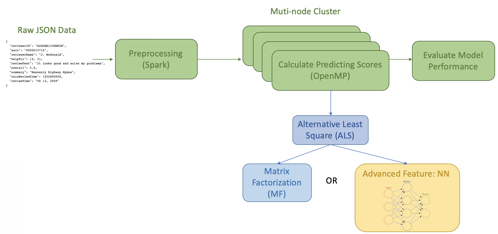

# Parallel Implementation of a Recommendation System for Amazon

CS205 Final Project: Zhaohong Jin, Zheyu Wu, Abhimanyu Vasishth, Yuhao Lu (Group 11)

[Project Website](https://cs205-group11.github.io/amazon-recommendation-system/) | [Source Code](https://github.com/JinZhaoHong/cs205_amazon_recommendation)

***

## About the Project

The goal of this project is to parallelize the process of generating product recommendations to Amazon's users. Specifically, we aim to predict, as accurately as possible, the rating a user gives to a particular product. If we are able to make accurate predictions, we can recommend products to users that they have not bought yet. 

To this end, we carry out a version of distributed Alternating Least Squares ([ALS](https://stanford.edu/~rezab/classes/cme323/S15/notes/lec14.pdf)) on an [Amazon Web Services](https://aws.amazon.com/) cluster with c5.9xlarge EC2 instances. A detailed programming model is given below: 

## Resources

Our [project website](https://cs205-group11.github.io/amazon-recommendation-system/) provides all the details and our [source code](https://github.com/JinZhaoHong/cs205_amazon_recommendation) is accessible as well.

## Run our Code and Tests

A detailed outline of how to run our code and test cases is given in the [usage section](https://cs205-group11.github.io/amazon-recommendation-system/#usage-instructions) of the website. This outlines how to install the dependencies, setup a cluster on AWS to exactly match our configurations, and run our code.

## Acknowledgements

This project could not have been possible without funding from SEAS Computing.
