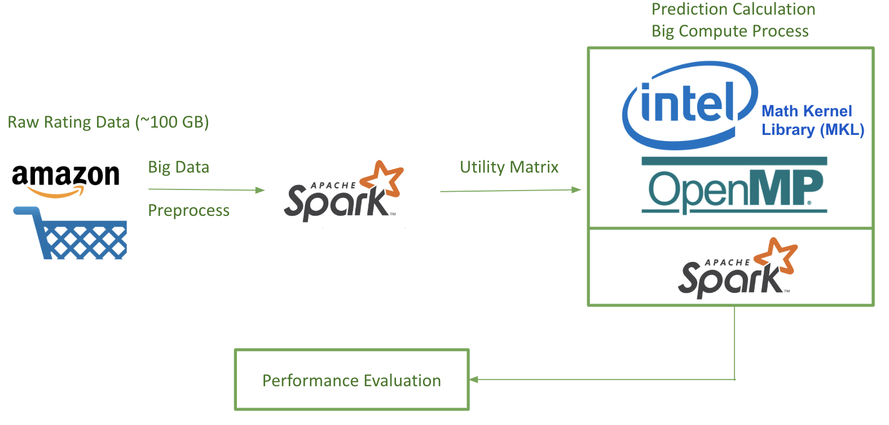
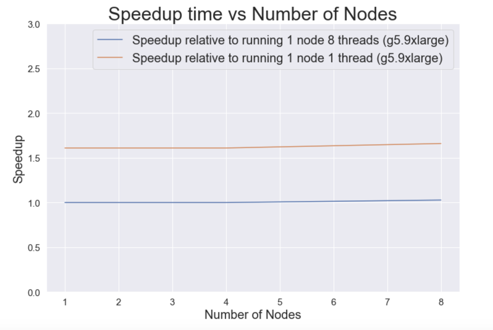
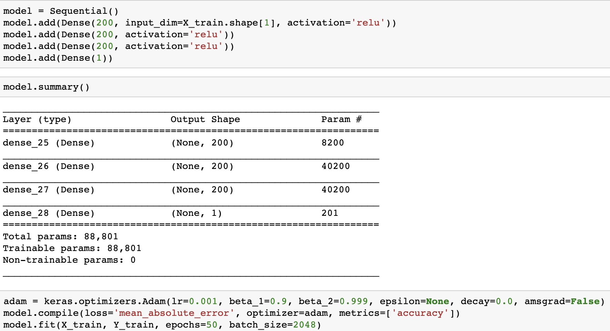

# Introduction

The goal of this project is to parallelize the process of generating product recommendations to Amazon's users. Specifically, we aim to predict, as accurately as possible, the rating a user gives to a particular product. If we are able to make accurate predictions, we can recommend products to users that they have not bought yet. 

## Problem Description

[Amazon](https://www.amazon.com/), the world's largest e-commerce marketplace, relies on targeted recommendations in order to sell a broad range of products to its users. These recommendations should be based on a user's previous purchase history as well as products that similar users have purchased. Therefore, computing how similar two users are is an essential part of the recommendation process. Good recommendations benefit both customers, who receive products that are better suited to their needs and are able to save shopping time, as well as Amazon itself, as they are able to sell a greater number of products, successfully market new products, and obtain customer loyalty as buying more products increases the quality of recommended products.  

## Existing Solutions to the Problem

There are two broad approaches to generate recommendations [1]: 

* Content-based systems: these systems aim to assess the features of the products being bought. They aim to classify products into different clusters or categories and then recommend other products within this cluster or category. Some examples of this technique include recommending athletic wear to customers who have bought sports equipment or recommending horror movies to customers who have watched other horror movies. 

* Collaborative filtering systems: these systems aim to assess the users purchasing items. Specifically, they provide a metric to compare how similar two users are and then recommend products that users that are similar to the target user rated highly. Our project will follow this approach and we analyze a few different methods and algorithms in the broad domain of collaborative filtering, including Standard Collaborative Filtering Model (SCF) and Matrix Factorization (MF) optimized through Alternative Least Square (ALS). 

## Need for Big Data and Big Compute

Amazon's dataset is not, unfortunately, neatly organized into a matrix of users and products. We are dealing with a large, unstructured dataset and in order to process it into a matrix of this form, we would need to make use of **big data processing** solutions such as Spark. Since Amazon has over 50 million users and 10 million products, a matrix this size would not fit on a single node, and we can take advantage of a distributed cluster of nodes in order to perform efficient pre-processing of this dataset. 

In order to compute similarity scores and generate predictions, we rely on a lot of matrix or vector products. These matrix operations can be made parallel through **big compute** and we use multi-threading to speed up these computations. Overall, the goal of our project is to increase the speedup of the whole process of generating recommendations, which includes pre-processing the raw dataset as well as computing predictions using the utility matrix, using a hybrid approach involving big-data processing and big-compute.

* * *

# Methodology and Design

## Data

The raw dataset that we use for this project is the "Amazon Product Data" that was collected by Julian McAuley et al. from University of California, San Diego (UCSD) [2]. We came across this dataset because it was used extensively in machine learning applications such as [3]. This dataset contains 142.8 million product reviews, as well as the associated metadata from Amazon spanning May 1996 to July 2014. Therefore, the size of this dataset is considerable (over 100 GB), and it is not practical to fit all the data on a single machine and to make useful recommendations. A sample review of this dataset is as follows:
```
{
  "reviewerID": "A2SUAM1J3GNN3B",
  "asin": "0000013714",
  "reviewerName": "J. McDonald",
  "helpful": [2, 3],
  "reviewText": "I bought this for my husband who plays the piano.  He is having a wonderful time playing these old hymns.  The music  is at times hard to read because we think the book was published for singing from more than playing from.  Great purchase though!",
  "overall": 5.0,
  "summary": "Heavenly Highway Hymns",
  "unixReviewTime": 1252800000,
  "reviewTime": "09 13, 2009"
}
```

As shown above, each product contains a range of attributes. The most interesting attributes for our application is `reviewerID`,`asin` and `overall`, and they have the following meanings:
* `reviewerID`: a unique string consisting of letters and numbers representing each individual reviewer.
* `asin`: a unique ID for the product.
* `overall`: the rating given by reviewer `reviewerID` to product `asin`, ranging from 1 to 5. 

## Recommendation System Model

In our project, we use two typical recommendation system models to perform benchmarking, based on the programming model mentioned in the next section. These two recommendation system models are:
* Standard Collaborative Filtering Model (SCF)
* Matrix Factorization (MF) optimized through Alternative Least Square (ALS)

In addition, we have another advanced recommendation system based on Neural Network. This new model will be covered in the Advanced Feature section.

### Model Setup

To begin with, we can assume that we have a *n* × *m* **utility matrix** [1], where *n* represents the number of user and *m* represents the number of products. Each entry in this matrix *r<sub>ij</sub>* is the rating given by user *i* to product *j*. For example, let us say we have 6 products: P1 through P6, and 5 users: U1 through U5. Since all users do not rate all products, the utility matrix ends up being quite sparse. The corresponding utility matrix looks as follows: 

|    | P1 | P2 | P3 | P4 | P5 | P6 |
|:---|:---|:---|:---|:---|:---|:---|
| U1 |  3 |    |  4 |  5 |    |    |
| U2 |  1 |    |    |    |  5 |    |
| U3 |    |    |  4 |    |    |  3 |
| U4 |    |  5 |  2 |    |  5 |    |
| U5 |  3 |    |    |  5 |    |  4 |

The overall goal, is to predict a rating that has not yet been given from user *i* to product *j* (i.e. calculate the predicted rating *r<sub>ij</sub>*).

|    | P1 | P2 | P3 | P4 | P5 | P6 |
|:---|:---|:---|:---|:---|:---|:---|
| U1 |  3 |  ? |  4 |  5 |  ? |  ? |
| U2 |  1 |  ? |  ? |  ? |  5 |  ? |
| U3 |  ? |  ? |  4 |  ? |  ? |  3 |
| U4 |  ? |  5 |  2 |  ? |  5 |  ? |
| U5 |  3 |  ? |  ? |  5 |  ? |  4 |

### Standard Collaborative Filtering Model (SCF)

In SCF, we predict the rating based on the nearest neighborhood algorithm (kNN). More specifically, we can calculate the **[cosine similarity](https://en.wikipedia.org/wiki/Cosine_similarity)** between the current user *i* to all other users, and select top *k* users based on the similarity score. From these *k* users, we can calculate the weighted average of ratings for product *j* with the cosine similarity as weights. We essentially use the [dot product](https://en.wikipedia.org/wiki/Dot_product) between two vectors to compute the angle between them. The smaller the angle, the closer the two vectors are to each other and the more similar the users. We then recommend products to users that users similar to them have rated highly. 

The **advantage** of this model is as follows:
* Easy to understand
* Easy to implement

However, this model suffers from following **limitations**:
* It is not computationally efficient
* It does not handle sparsity well (i.e. It does not have accurate predictions if there are not enough reviews for a product)

### Matrix Factorization (MF) optimized through Alternative Least Square (ALS)
In light of above two limitations of SCF, matrix factorization is a more advanced technique that decomposes the original sparse matrix to lower-dimensional matrices incorporating latent vectors. These latent vectors may include higher-level attributes which are not captured by ratings for individual products. 


To factorize a matrix, single value decomposition is a common technique, where a matrix *R* can be decomposed of matrices *X, Σ, Y*, where *Σ* is a matrix containing singular values of the original matrix. However, given that R is a sparse matrix, we can find matrices *X* and *Y* directly, with the goal that the product of *X* and *Y* is an approximation of the original matrix *R* (as shown above). 

Therefore, this problem is turned into an optimization problem to find *X* and *Y*. One way to numerically compute this is Alternative Least Square (ALS) [4], where either the user factor matrix or item factor matrix is held constant in turn, and update the other matrix. Once we obtain X and Y, the predicted rating matrix can be simply found by the matrix multiplication of X and Y.

## Parallel Application and Programming Model

The parallelism of our application lies in the following aspects:
* Data Preprocessing
* Rating Prediction

### Data Preprocessing
As shown in the Data section above, the raw dataset is in the form of `JSON`, and it contains a range of irrelevant data such as `reviewText`, `summary` and `reviewTime`. In order to extract interesting attributes (`reviewerID`, `asin` and `overall`) from over 100 GB of data, a well-designed data preprocessing pipeline needs to be implemented. 
Below, we have shown this pipeline powered by Spark, a distributed cluster-computing framework used extensively in industry.


The input of this data pipeline is the raw `JSON` file containing all the metadata for a given product. The output of this data pipeline is the utility matrix mentioned above. 

### Rating Prediction
As introduced above, we will use different types of collaborative filtering systems for rating prediction. 

For SCF, the cosine similarity is calculated as:


And the prediction is given by:


Here,

* P<sub>u,i</sub> is the predicted rating from user u to item i
* R<sub>v,i</sub> is the rating given by a user v to a movie i
* S<sub>u,v</sub> is the cosine similarity between the user u and v

**Parallelism**: Since calculating the cosine similarity between every pair of user is independent, we can therefore use OpenMP to parallelize the algorithm. Further, we have distributed the workload across different nodes using Spark to increase model performance.

For ALS, we are using the following algorithm [4] to iteratively find latent matrix X and Y:


where X and Y are the latent matrices consisting of latent vectors for each individual user and item in *k* dimension, assuming overall we have *n* users and *m* items. They have the following form:


Once we obtain X and Y from ALS, we can either use R = X<sup>T</sup>Y or a neural network (advanced feature) to calculate prediction.

**Parallelism**: In order to increase the performance, all models are running on a multi-node cluster, which is further optimized by increasing the number of threads on each node through OpenMP. To take advantage of this multi-node cluster, we have used the distributed ALS algorithm as follows:


### Overall Programming Model Flowchart
To summarize, the overall programming model is as follows:


## Platform and Infrastructure

In this project, we have used a number of platforms and infrastructures covered in the lecture. The following flowchart illustrates the platform that we are using.


*Note on the usage of OpenMP*: By default, Python is subject to Global Interpreter Lock (GIL), which prevents more than one threads to run at a time. However, the underlying libraries of `Numpy` and `SciPy`  are written in C, making it possible for multithreading optimization. For linear algebra related applications, the underlying library is BLAS, and it includes some variants such as OpenBLAS, Intel MKL and ATLAS. A benchmark regarding their performance can be found here [5]. For our application, we decided to use Intel MKL, since it provides the highest speedup among all BLAS variants. Intel MKL is now packaged within Intel Distribution for Python [6], which is used in our application (see "How to Use our Code" section below). By using Intel Distribution for Python, we can achieve OpenMP's multithreading performance, and yet enjoy the simplicity of Python [7]. In other words, thanks to Intel's Distribution for Python, all Numpy-related code is automatically optimized through OpenMP, and we can control the number of threads in the same way as a C program: ```export OMP_NUM_THREADS=<number of threads to use>```
* * *

# Usage Instructions

## Software Design

Discuss Software design here

You should mention software design, code baseline, dependencies

Our entire source code can be found in our [github repository](https://github.com/JinZhaoHong/cs205_amazon_recommendation).

For our recommendation system, everything from reading the data to processing the data to generating the results uses Spark dataframe and Spark RDD. Package wise, we use Spark and Intel's distribution of Python + NumPy(with OpenMP support on the backend). The workflow of the software design is shown in the below graph.


## How to Use our Code

To get started, follow [Guide: First Access to AWS](https://docs.google.com/document/d/1pbawfF3BNtT4iviQ5ZcMwNi9DNxjcZCqIQxcN1afV8I/edit) to create an AWS account and key pairs for remote log in.

1. Log in AWS Management Console.

2. Follow [Guide: Spark Cluster on AWS](https://docs.google.com/document/d/1mBQAHfqlpu2WGeu48MGmNjo-m4r3IZha1HqFGXqcw_k/edit#) to create an EMR cluster. When asked to choose instance type, select c5.9xlarge with 9 nodes (1 master node + 8 worker nodes). Some of the specifications and libraries of the cluster that we used are as follows: 

* c5.9xlarge: 36 vCPUs, 72 GiB memory, EBS-Only storage, 7,000 Mbps Dedicated EBS Bandwidth, 10 Gbps Network Performance
* Core Hadoop: Hadoop 2.8.5 with Ganglia 3.7.2, Hive 2.3.4, Hue 4.3.0, Mahout 0.13.0, Pig 0.17.0, and Tez 0.9.1

**Note**: It is possible that your limit for creating this type of instances is too low (e.g. 0). If this is the case, you need to contact the technical support and create a request to increase this limit. 

3. The next step is to increase the volume of all nodes on the virtual machine to deal with the large dataset. The default partition size is not able to load the entire dataset. The following process must be followed for all 8 code nodes and 1 master node: 

* Navigate back to the EMR web interface, and click the 'Hardware' tab
* Click the ID of the master/or worker node 
* Click the EC2 instance ID 
* In the 'Description' tab click on root device e.g. /dev/xvda
* Click on the volume link (e.g. vol-094ce3910j)
* Click on actions and modify the volume. You may change from 10 GB to 256 GB.
* Navigate back to the terminal, and check partition size using `lsblk`
* In the terminal, run `sudo growpart /dev/xvda 1`
* In the terminal, run `sudo resize2fs /dev/nvme0n1p1`
* Finally, to check the updated storage, we can use this command `df -h`. Your partition size should be 256 GB now. 

4. `ssh` into the all nodes (including master and all worker nodes). Follow [this instruction](https://software.intel.com/en-us/distribution-for-python/choose-download/linux) to download and install Intel Distribution for Python for **all nodes**. This version of Python is built upon Intel Math Kernel Library(MKL) and it outperforms the original version of Python in numerical calculations since they are optimized on Intel processors. 

5. Download the rating dataset. It may take a while (~40 mins) to complete this process depending on your network bandwidth.
```
wget http://snap.stanford.edu/data/amazon/productGraph/aggressive_dedup.json.gz
```

6. Extract the rating data using `gzip`.
```
gzip -d aggressive_dedup.json.gz
```

7. Move the rating data into the hadoop file system.
```
hadoop fs -put aggressive_dedup.json
```

8. Delete the original copy.
```
rm -r aggressive_dedup.json 
```

9. Clone the GitHub repository containing all source code. 
```
git clone https://github.com/JinZhaoHong/cs205_amazon_recommendation.git 
```

* Note: It is possible that `git` is not installed on your virtual machine. If this is the case, you can install git by running this command in the terminal `yum install git-core`.

10. We use the `als_recommendation.py` file. Change directory into the github repository as follows: 
```
cd cs205_amazon_recommendation/
```

11. Submit the job. Here is an example command to carry this out. 

```
spark-submit --num-executors 2 --executor-cores 8 --driver-memory 8g --executor-memory 8g  als_recommendation.py aggressive_dedup.json 
```

* To increase executor/driver memory, we can add the flags:
``` 
--driver-memory 2g --executor-memory 2g
```

* To increase the number of executors and the number of executor cores, we can add the flags:
``` 
--num-executors 2 --executor-cores 8
```

12. While this job is being executed, you will see a series of outputs in the terminal. When this job is completed, you should see some newly generated folder on the hdfs.
```
hadoop fs -ls
```

13. If you run the code again, don't forget to delete the output generated by the previous run. For example:
```
hadoop fs -rm -r X
```

## How to Run Tests

In this project, we have conducted a series of tests to validate our recommendation system. We looked into a variety of Amazon shopping histories for products in Music, Kindle, Books as well as Movies and TV. These dataset are of different sizes, and can be found [here](http://jmcauley.ucsd.edu/data/amazon/). 


To run the test, simply follow the usage guide above from step 2 to start downloading corresponding "5-core" data from the link provided above. Perform all the following similar steps to run the test. The result of these test can be found in the "Results" section below.

* * *

# Results

## Performance Evaluation

First, we vary the number of nodes (executors) on our cluster. The number of threads in each case was 8. We also utilized caching on memory and RDD.

|  Nodes  | Execution Time (s) | Speedup | Flags
|:--:|:--:|:--:|:--:|
| 1 | 222 |  1.00 | --num-executors 1 --executor-cores 8 --driver-memory 8g --executor-memory 8g | 
| 2 | 222 |  1.00 | --num-executors 2 --executor-cores 8 --driver-memory 8g --executor-memory 8g |
| 4 | 222 |  1.00 | --num-executors 4 --executor-cores 1 --driver-memory 8g --executor-memory 8g |
| 8 | 216 |  1.03 | --num-executors 8 --executor-cores 1 --driver-memory 8g --executor-memory 8g |

A plot of execution times is given below: 



Second, we vary the number of threads per node (executor) on our cluster. The number of nodes in each case was 8. We also utilized caching on memory and RDD.

|  Threads per Node  | Execution Time (s) | Speedup | Flags
|:--:|:--:|:--:|:--:|
| 1  | 282 | 1.00 | --num-executors 8 --executor-cores 1 --driver-memory 20g --executor-memory 50g | 
| 2  | 222 | 1.27 | --num-executors 8 --executor-cores 2 --driver-memory 20g --executor-memory 25g |
| 4  | 210 | 1.34 | --num-executors 8 --executor-cores 4 --driver-memory 10g --executor-memory 15g |
| 8  | 216 | 1.31 | --num-executors 8 --executor-cores 8 --driver-memory 8g  --executor-memory 8g  |
| 16 | 210 | 1.34 | --num-executors 8 --executor-cores 16 --driver-memory 8g --executor-memory 4g  |

A plot of execution times is given below: 


Third, to test for weak scalability, we run our code using different problem sizes. This is reflected by the size (in gigabytes) of the dataset we use. We use 8 nodes and 8 threads and carry out caching on memory and RDD. **Note**: the sizes are given for the zipped files. The unzipped files are ~4x larger.

|  Dataset Name | Zipped Dataset Size (GB)  | Execution Time (s) |
|:--:|:--:|:--:|
| Music | 0.03 | 17 |
| Kindle | 0.30 |  19 |
| Movies and TV | 0.68 | 19 |
| Books | 3 |  26 |
| Aggregated Dataset | 17.7 | 216 |

## Optimizations and Overheads

Discussion about overheads and optimizations done

* * *

# Advanced Features

## Improving ALS Prediction Accuracy using a Neural Network

### Summary
Assume we have user i and product p. The naive Alternating Least Squares method uses dot product between two latent vectors(each has 20 dimensions, for example) to generate the predicted rating. However, given two latent vectors we can explore more sophisicated relationships than simple dot product. Therefore, we implemented a densely connected nerual network as a post-processing step on all the generated latent vectors to generate the ratings. A densely connected neural network is a universal functional approximator that can approximate any distribution. So we use this method in order to improve our accuracy (measured using mean absolute error (MAE)).

### Implementation Details

The implementation of the neural network uses Keras with Tensorflow. 



### Result

The baseline dot product using our recommendation_als.py on Kindle dataset with hidden dimension = 20 and iteration = 15 has a mean absolute error of 0.50775. The nerual network on the same setting yields a mean absolute error of 0.29846. 

## Intel Python Library with Advanced Optimization

We chose Intel Distribution for Python https://software.intel.com/en-us/distribution-for-python to do all our experiments. This distribution gives us faster Python performance for packages such as NumPy, SciPy and scikit-learn. For the NumPy package, Intel's python distribution allows us to access the latest vectorization and multithreading instructions based on OpenMP framework. Our code relies on a lot of matrix/vector multiplications, so using this distribution is ideal to improve our performance. Our test run (on the full 18 gb dataset, with Alternating Least Squares) shows a 20 seconds improvement on average.  


## Other Optimizations: Caching and Executor Memory Tuning

Due to the large amount data loaded into the executor, we often run into Java Out of Memory error. Therefore, we need to dynamically allocate the amount of memory assigned to each thread as we change the total number of running thread. To achieve this, we use the optimization flags --driver-memory, --executor-memory to control how much memory we are allocating to the driver and the worker node. In addition, we will use caching techniques to reduce the cost of having to compute some big RDD multiple times. Caching in Spark allows the program to store the computed results so that each further reference to the RDD doesn't have to re-compute the values again. Spark allows us to use multiple caching options such as MEMORY_ONLY, MEMORY_AND_DISK, and DISK_ONLY. MEMORY_ONLY caching allow us to cache RDDs in memory and for those that doesn't fit in the RAM, they will be recomputed on the fly. DISK_ONLY stores computed RDD on disk only. Reading and writing from disk will incur some I/O cost. For complex RDD transformations with large data, DISK_ONLY is a good option. MEMORY_AND_DISK option is the most flexible one as it first attemps to store RDD in memory, and then in disk, and finally compute them on the fly if there is no space in disk.
* * *

# Discussion

In this project, we designed, implemented and tested the distributed recommendation system for around 100 GB data from Amazon. We first identified the need for big compute and big data, and based on these needs we decided to use Spark and OpenMP as our basic infrastructure and platform. We then identified the main overhead in our application is the data loading process. To mitigate this overhead, we tried both cache and adjustment of executor memory and it turned out that adjustment of executor memory is a more effective approach. We then tested our application on a variety of data sizes (scalability, throughput), number of threads, number of nodes (speedup). 

## Goals Achieved

For this application, we have achieved following goals:

* **Overall**: We have successfully built a **distributed recommendation system based on Spark and OpenMP**, which is able to intelligently recommend costumers with new products, based on his and other customers' purchasing history.
* **Accuracy**: We have tested the prediction accuracy both for ALS and our advanced feature (densely connected neural network). The Mean Absolute Error for ALS is 0.50775 and for the neural network is 0.29846. This is very accurate given that ratings given by users on Amazon ranges from 1 to 5 inclusively.
* **Speedup**: As shown in the "Performance Evaluation" section above, our application is able to achieve a speedup of **1.34**, when running with 16 threads on each node on a 8-node AWS c5.9xlarge-based cluster.
* **Throughput**: As shown in the "Performance Evaluation" section above, our application is able to handle up to 100 GB of data.
* **Scalability**: As shown in the "Performance Evaluation" section above, our application is able to process a range of dataset with different sizes. That is, from small dataset (music data with 64,706 reviews) to the entire dataset (over 20 categories with 142.8 million reviews)

## Improvements Suggested

In retrospect, some improvements that could be done include:

* Implement our application on GPU instances to facilitate larger parallelism
* Implement distributed neural network
* Implement online recommendation system using streaming data 

## Interesting Insights and Lessons Learnt

Some of the important lessons that we learnt and insights that we gathered through this project are:

* Dealing with large datasets (>10 GB) is a completely different challenge than dealing with datasets that we have typically dealt with (<1 GB). Our initial solution involved creating a few temporary dataframes and tables in Spark and this solution worked extremely well for a toy dataset, however created severel memory issues when applied to a larger dataset as these temporary dataframes were each on the order of a few gigabytes. Therefore, we had to be extremely careful about how to deal with intermediate results and avoided the creation of temporary dataframes and tables as far as possible.
* If we were actually employees of Amazon working on building a distributed recommendation system using AWS, we would have to pay more attention to the costs and benefits of different cluster configurations. We wanted to use at least 8 nodes and wanted each node to have at least 16 vCPUs in order to demonstrate the benefits of our hybrid architecture, however we did not factor in the cost of running each node and instance into our final cluster architecture since we only ran experiments for a limited time. Running a cluster for a long period of time would necessitate an analysis of the cost vs performance of different number of nodes and different instance types.
* It is extremely important to keep the codebase for a project such as this as simple as possible. This makes it possible to easily profile different sections of code, understand where speedup is possible, and be able to debug. Therefore, since we were creating a codebase from scratch, our emphasis was to make this codebase not overly complex.
* Downloading the dataset on the cluster for a dataset this size was manageable, but time consuming. For a dataset 1000x larger than this, which is not an unreasonable size given the number of customers and products at Amazon, this is not a scalable solution. In order to do this better for a much larger dataset, one could either use specific, network-optimized instances from AWS. 

## Future Work

Some next steps that we could take are listed below:

* This work acts as a promising starting point to carry out online recommendations using real-time streaming data. Amazon users often buy and browse through products daily, and having to compute batch recommendations frequently using the full dataset can be extremely expensive. 
* Having said the above, we recognize that we used only a subset of Amazon's total data and we would like to extend our project to a much larger (multi-TB) dataset. We were successfully able to translate our methodology from a dataset on the order of megabytes to a dataset around 100GB in size and understood many of the non-trivial challenges that are involved in this shift, and believe that the logical next step is to further increase dataset size and repeat the experiment.
* We predominantly used Alternating Least Squares (ALS), however there are several algorithms used in recommendation systems. We would like to extend our study to comparing between numerous different algorithms for creating recommendations for different-sized datasets in order to determine the optimal algorithm for a dataset of a given size.

* * *

# References
[1] Jeffrey D. Ullman, "Mining Massive Datasets: Recommendation Systems"[Online]. Accessed May 6th, 2019. Available: http://infolab.stanford.edu/~ullman/mmds/ch9.pdf

[2] R. He, J. McAuley WWW, "Ups and downs: Modeling the visual evolution of fashion trends with one-class collaborative filtering", Accessed May 6th, 2019. Available: https://arxiv.org/abs/1602.01585

[3] Alec Radford, Rafal Jozefowicz, and Ilya Sutskever, "Learning to generate reviews and discovering sentiment". Accessed May 6th, 2019. CoRR, abs/1704.01444.

[4] Haoming Li, Bangzheng He, Michael Lublin, Yonathan Perez, "Matrix Completion via Alternating Least Square(ALS)" [Online]. Accessed May 6th, 2019. Available: http://stanford.edu/~rezab/classes/cme323/S15/notes/lec14.pdf

[5] Markus Beuckelmann, "Boosting Numpy: Why BLAS matters"[Online]. Accessed May 6th, 2019. Available: https://markus-beuckelmann.de/blog/boosting-numpy-blas.html

[6] Intel, "Intel Distribution for Python"[Online]. Accessed May 6th, 2019. Available:  https://software.intel.com/en-us/distribution-for-python

[7] Intel, "Using Intel® MKL with Threaded Applications"[Online]. Accessed May 6th, 2019. Available: https://software.intel.com/en-us/articles/intel-math-kernel-library-intel-mkl-using-intel-mkl-with-threaded-applications#3
