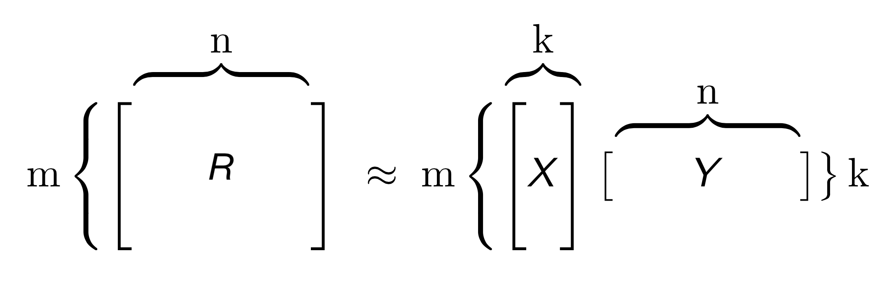
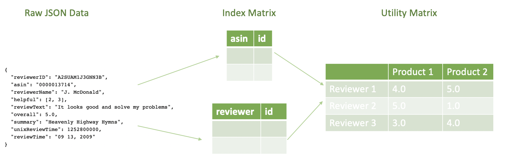

Text can be **bold**, _italic_, or ~~strikethrough~~.

[Link to another page](./another-page.html).

There should be whitespace between paragraphs. 

# Introduction

The goal of this project is to parallelize the process of generating product recommendations to Amazon's users. Specifically, we aim to predict, as accurately as possible, the rating a user gives to a particular product. If we are able to make accurate predictions, we can recommend products to users that they have not bought yet. 

## Problem Description

[Amazon](https://www.amazon.com/), the world's largest e-commerce marketplace, relies on targeted recommendations in order to sell a broad range of products to its users. These recommendations should be based on a user's previous purchase history as well as products that similar users have purchased. Therefore, computing how similar two users are is an essential part of the recommendation process. Good recommendations benefit both customers, who receive products that are better suited to their needs and are able to save shopping time, as well as Amazon itself, as they are able to sell a greater number of products, successfully market new products, and obtain customer loyalty as buying more products increases the quality of recommended products.  

## Existing Solutions to the Problem

There are two broad approaches to generate recommendations: 

* Content-based systems: these systems aim to assess the features of the products being bought. They aim to classify products into different clusters or categories and then recommend other products within this cluster or category. Some examples of this technique include recommending athletic wear to customers who have bought sports equipment or recommending horror movies to customers who have watched other horror movies. 

* Collaborative filtering systems: these systems aim to assess the users purchasing items. Specifically, they provide a metric to compare how similar two users are and then recommend products that users that are similar to the target user rated highly. Our project will follow this approach and we analyze a few different methods and algorithms in the broad domain of collaborative filtering, including Standard Collaborative Filtering Model (SCF) and Matrix Factorization (MF) optimized through Alternative Least Square (ALS). 

### Collaborative Filtering

In order to perform collaborative filtering, one needs to create a **utility matrix** [[1](http://infolab.stanford.edu/~ullman/mmds/ch9.pdf)]. This rows of this utility matrix correspond to users, and the columns correspond to products. Each entry in the matrix is the rating (1-5, both inclusive) given to a product by a user. For example, let us say we have 6 products: P1 through P6, and 5 users: U1 through U5. Since all users do not rate all products, the utility matrix ends up being quite sparse. The corresponding utility matrix looks as follows: 

|    | P1 | P2 | P3 | P4 | P5 | P6 |
|:---|:---|:---|:---|:---|:---|:---|
| U1 |  3 |    |  4 |  5 |    |    |
| U2 |  1 |    |    |    |  5 |    |
| U3 |    |    |  4 |    |    |  3 |
| U4 |    |  5 |  2 |    |  5 |    |
| U5 |  3 |    |    |  5 |    |  4 |

Now, in order to recommend products to a new user, U6, we must first find users in our dataset who are similar to U6. In order to do this, we use a metric called **[cosine similarity](https://en.wikipedia.org/wiki/Cosine_similarity)**, where U6 is treated like a vector and compared with other users in the dataset, also treated as vectors. We essentially use the [dot product](https://en.wikipedia.org/wiki/Dot_product) between two vectors to compute the angle between them. The smaller the angle, the closer the two vectors are to each other and the more similar the users. We then recommend U6 products that these similar users have rated highly.

## Need for Big Data and Big Compute

Amazon's dataset is not, unfortunately, neatly organized into a matrix of users and products. We are dealing with a large, unstructured dataset and in order to process it into a matrix of this form, we would need to make use of **big data processing** solutions such as Spark. Since Amazon has over 50 million users and 10 million products, a matrix this size would not fit on a single node, and we can take advantage of a distributed cluster of nodes in order to perform efficient pre-processing of this dataset. 

In order to compute similarity scores and generate predictions, we rely on a lot of matrix or vector products. These matrix operations can be made parallel through **big compute** and we use multi-threading to speed up these computations. Overall, the goal of our project is to increase the speedup of the whole process of generating recommendations, which includes pre-processing the raw dataset as well as computing predictions using the utility matrix, using a hybrid approach involving big-data processing and big-compute.

* * *

# Methodology and Design

## Data

The raw dataset that we use for this project is the "Amazon Product Data" that was collected by Julian McAuley et al. from University of California, San Diego (UCSD) [1]. We came across this dataset because it was used extensively in machine learning applications such as [2]. This dataset contains 142.8 million product reviews, as well as the associated metadata from Amazon spannning May 1996 to July 2014. Therefore, the size of this dataset is considerable (over 100 GB), and it is not practical to fit all the data on a single machine and to make useful recommendations. A sample review of this dataset is as follows:
```
{
  "reviewerID": "A2SUAM1J3GNN3B",
  "asin": "0000013714",
  "reviewerName": "J. McDonald",
  "helpful": [2, 3],
  "reviewText": "I bought this for my husband who plays the piano.  He is having a wonderful time playing these old hymns.  The music  is at times hard to read because we think the book was published for singing from more than playing from.  Great purchase though!",
  "overall": 5.0,
  "summary": "Heavenly Highway Hymns",
  "unixReviewTime": 1252800000,
  "reviewTime": "09 13, 2009"
}
```

As shown above, each product contains a range of attributes. The most interesting attributes for our application is `reviewerID`,`asin` and `overall`, and they have the following meanings:
* `reviewerID`: a unique string consisting of letters and numbers representing each individual reviewer.
* `asin`: a unique ID for the product.
* `overall`: the rating given by reviewer `reviewerID` to product `asin`, ranging from 1 to 5. 

## Recommandation System Model

In our project, we use two typical recommendation system models to perform benchmarking, based on the programming model mentioned in the next section. These two recommendation system models are:
* Standard Collaborative Filtering Model (SCF)
* Matrix Factorization (MF) optimized through Alternative Least Square (ALS)

In addition, we have another advanced recommendation system based on Neural Network. This new model will be covered in the Advanced Feature section.

### Model Setup
To begin with, we can assume that we have a *n* × *m* matrix, where *n* represents the number of user and *m* represents the number of products (i.e. the utility matrix shown above). Each entry in this matrix *r<sub>ij</sub>* is the rating given by user *i* to product *j*.
The overall goal, is to predict a rating that has not yet been given from user *i* to product *j* (i.e. calculate the predicted rating *r<sub>ij</sub>*).

|    | P1 | P2 | P3 | P4 | P5 | P6 |
|:---|:---|:---|:---|:---|:---|:---|
| U1 |  3 |  ? |  4 |  5 |  ? |  ? |
| U2 |  1 |  ? |  ? |  ? |  5 |  ? |
| U3 |  ? |  ? |  4 |  ? |  ? |  3 |
| U4 |  ? |  5 |  2 |  ? |  5 |  ? |
| U5 |  3 |  ? |  ? |  5 |  ? |  4 |

### Standard Collaborative Filtering Model (SCF)
In SCF, we predict the rating based on the nearest neighborhood algorithm (kNN). More specifically, we can calculate the **cosine similarity** between the current user *i* to all other users, and select top *k* users based on the similarity score. From these *k* users, we can calculate the weighted avaerage of ratings for product *j* with the cosine similarity as weights. This averaged rating is used as *r<sub>ij</sub>*.

The **advantage** of this model is as follows:
* Easy to understand
* Easy to implement

However, this model suffers from following **limitations**:
* It is not computationally efficient
* It does not handle sparsity well (i.e. It does not have accurate predictions if there are not enough reviews for a product)

### Matrix Factorization (MF) optimized through Alternative Least Square (ALS)
In light of above two limitations of SCF, matrix factorization is a more advanced technique that decomposes the original sparse matrix to lower-dimensional matrices incorporating latent vectors. These latent vectors may include higher-level attributes which are not captured by ratings for individual products. 



To factorize a matrix, single value decomposition is a common technique, where a matrix *R* can be decomposed of matrices *X, Σ, Y*, where *Σ* is a matrix containing singular values of the original matrix. However, given that R is a sparse matrix, we can find matrices *X* and *Y* directly, with the goal that the product of *X* and *Y* is an approximation of the original matrix *R*. 

Therefore, this problem is turned into an optimization problem to find *X* and *Y*, whose product is a good approximation of *R*. One way to numerically compute this is Alternative Least Square (ALS) [3], where either the user factor matrix or item factor matrix is held constant in turn, and update the other matrix. Once we obtain X and Y, the predicted rating matrix can be simply found by the matrix multiplication of X and Y.

## Parallel Application and Programming Model

The parallelism of our application lies in the following aspects:
* Data Preprocessing
* Rating Prediction

### Data Preprocessing
As shown in the Data section above, the raw dataset is in the form of `JSON`, and it contains a range of irrelevant data such as `reviewText`, `summary` and `reviewTime`. In order to extract interesting attributes (`reviewerID`, `asin` and `overall`) from over 100 GB of data, a well-designed data preprocessing pipeline needs to be implemented. 
Below, we have shown this pipeline powered by Spark, a distributed cluster-computing framework used extensively in industry.



The input of this data pipeline is the raw json file containing all the metadata for a given product. The output of this data pipeline is the utility matrix mentioned above. 

### Rating Prediction
As introduced above, we will use different types of collaborative filtering systems for rating prediction. 

For SCF, the cosine similarity is calculated as:


And the prediction is given by:


Here,

* P<sub>u,i</sub> is the predicted rating from user u to item i
* R<sub>v,i</sub> is the rating given by a user v to a movie i
* S<sub>u,v</sub> is the cosine similarity between the user u and v

**Parallelism**: Since calculating the cosine similarity between every pair of user is independent, we can therefore use OpenMP to parallelize the algorithm. Further, we have distributed the workload across different nodes using Spark to increase model performance.

For ALS, we are using the following algorithm [5] to iteratively find latent matrix X and Y:


where X and Y are the latent matrices consisting of latent vectors for each individual user and item in *k* dimension, assuming overall we have *n* users and *m* items. They have the following form:


Once we obtain X and Y from ALS, we can either use R = X<sup>T</sup>Y or a neural network (advanced feature) to calculate prediction.

**Parallelism**: In order to increase the performance, all models are running on a multi-node cluster, which is further optimized by increasing the number of threads on each node through OpenMP. To take advantage of this multi-node cluster, we have used the distributed ALS algorithm as follows:


### Overall Programming Model Flowchart
To summarize, the overall programming model is as follows:


## Platform and Infrastructure

In this project, we have used a number of platforms and infrastructures covered in the lecture. The following 


* * *

# Usage Instructions

## Software Design

Discuss Software design here

```
Long, single-line code blocks should not wrap. They should horizontally scroll if they are too long. This line should be long enough to demonstrate this.
```

```
The final element.
```

## How to Use our Code

To get started, follow [Guide: First Access to AWS](https://docs.google.com/document/d/1pbawfF3BNtT4iviQ5ZcMwNi9DNxjcZCqIQxcN1afV8I/edit) to create AWS account and key pairs for remote log in.

1. Log in AWS Management Console.

2. Follow [Guide: Spark Cluster on AWS](https://docs.google.com/document/d/1mBQAHfqlpu2WGeu48MGmNjo-m4r3IZha1HqFGXqcw_k/edit#) to create an EMR cluster. When asked to choose instance type, select c5.9xlarge with 9 nodes (1 master node + 8 worker nodes)
  * Note: It is possible that your limit for creating this type of instances is too low (e.g. 0). If this is the case, you need to contact the customer support and create a request to increase this limit. 

3. `ssh` into the all nodes (including master and all worker nodes). Follow [this instruction](https://software.intel.com/en-us/distribution-for-python/choose-download/linux) to download and install Intel Distribution for Python for all nodes. This version of Python outperforms the original version of Python in numerical calculations, since they are optimized on Intel processors. 

4. Before downloading the dataset, you need to increase the volume of the virtual machine since we have a large dataset. To do this we need to:

* Navigate back to the EMR web interface, and click the 'Hardware' tab
* Click the ID of the master/or worker node
* Click the EC2 instance ID
* In the 'Description' tab click on root device e.g. /dev/xvda
* Click on the volume link (e.g. vol-094ce3910j)
* Click on actions and modify the volume. You may change from 10 GB to 256 GB.
* Navigate back to the terminal, and check partition size using `lsblk`
* In the terminal, run `sudo growpart /dev/xvda 1`
* In the terminal, run `sudo resize2fs /dev/nvme0n1p1`
* Finally, to check the updated storage, we can use this command `df -h`

5. Download the rating dataset. It may take ~1 hour to complete this process.
```
wget http://snap.stanford.edu/data/amazon/productGraph/aggressive_dedup.json.gz
```
6. Extract the rating data using `gzip`
```
gzip -d aggressive_dedup.json.gz
```

7. Move the rating data into the hadoop file system.
```
hadoop fs -put aggressive_dedup.json
```

8. Delete the original copy.
```
rm -r aggressive_dedup.json 
```

9. Clone the GitHub repository containing all source code.
```
git clone https://github.com/JinZhaoHong/cs205_amazon_recommendation.git 
```

10. Submit the job.
```
spark-submit --num-executors 8 --executor-cores 32  als_recommendation.py aggressive_dedup.json
```
* To increase executor memory, add the flag
``` 
--driver-memory 2g --executor-memory 2g
```

11. While this job is being executed, you will see a series of outputs in the terminal. When this job is completed, you should see some newly generated folder on the hdfs.
```
hadoop fs -ls
```

12. If you run the code again, don't forget the delete the output generated by the previous run. For example:
```
hadoop fs -rm -r X

```


## How to Run Tests

How to run tests

### Definition lists can be used with HTML syntax.

<dl>
<dt>Name</dt>
<dd>Godzillaa</dd>
<dt>Born</dt>
<dd>1952</dd>
<dt>Birthplace</dt>
<dd>Japan</dd>
<dt>Color</dt>
<dd>Green</dd>
</dl>

* * *

# Results

## Performance Evaluation

Speed-up, throughput, weak and strong scaling

## Optimizations and Overheads

Discussion about overheads and optimizations done

* * *

# Advanced Features

Discussion about advanced features here

* * *

# Discussion

Discuss

## Goals Achieved

Goals Achieved here

## Improvements Suggested

Improvements suggested here

## Interesting Insights

Interesting insights here

## Lessons Learnt

Lessons learnt here

## Future Work

Future work here

* * *

# References

References here
